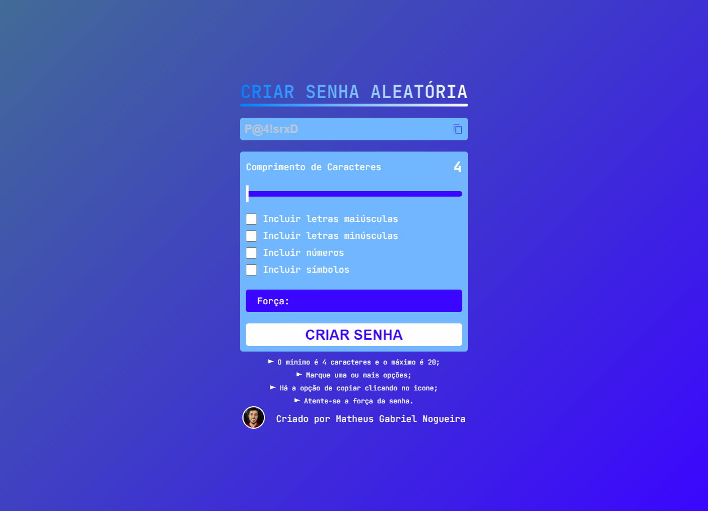

<h1 align="center"> Senha Aleatória </h1>

  <a href="#-tecnologias">Tecnologias</a>&nbsp;&nbsp;&nbsp;|&nbsp;&nbsp;&nbsp;
  <a href="#-projeto">Projeto</a>&nbsp;&nbsp;&nbsp;|&nbsp;&nbsp;&nbsp;
  <a href="#-layout">Layout</a>&nbsp;&nbsp;&nbsp;|&nbsp;&nbsp;&nbsp;
  <a href="#-redes">Redes</a>

---

  

---

## 🚀 Tecnologias

Esse projeto foi desenvolvido com as seguintes tecnologias:

-  HTML
-  CSS
-  JavaScript
-  Node
-  Vite
-  SweetAlert2 (Lib)

## 💻 Projeto

O projeto é um desafio que encontrei no FrontendMentor ao qual o intuito é criar um gerador de senhas aletórias sendo possível então escolher qual o comprimento da senha e como deseja que ela seja criada, se com letras maiúsculas, minúsculas, números e/ou símbolos.
A medida que vai sendo escolhido o comprimento da senha e o que ela vai conter é possível ver também a força da senha. É possível copiar a senha clicando no ícone ao lado da senha.

Foi trabalhado com o Vite que fornece um servidor de desenvolvimento e permite também compilar um código em pequenos pedaços e em seguida importar para um outro pedaço de código.
Além do Vite trabalhei também com SweetAlert2 que é uma biblioteca de alert aonde tem diversos modelos de alert e permite que seja também estilizado da maneira que desejar.

Foi um baita desafio pois me fez praticar e trabalhar bastante a parte lógica.

## 🔖 Layout

Você pode visualizar o layout do projeto através [DESSE LINK](https://www.frontendmentor.io/challenges/password-generator-app-Mr8CLycqjh).

---

## 🔗 Redes

Estas são minhas redes sociais. Sinta-se a vontade para mandar uma mensagem.

-  [Linkedin](https://www.linkedin.com/in/eomgn/)
-  [Instagram](https://www.instagram.com/matheuzngr/)
-  [Twitter](https://twitter.com/eomgn)
